# ☕ Cafe Moon — ქუთაისის კაფეს ვებ-საიტი

## პროექტის სახელი
**Cafe Moon** — საუკეთესო ყავა და დესერტები ქუთაისში

## აღწერა
Cafe Moon არის თანამედროვე, რესპონსიული ვებ-აპლიკაცია ქუთაისში მდებარე კაფესთვის. პროექტი შექმნილია React-ით და TypeScript-ით, გამოიყენება Tailwind CSS დიზაინისთვის, Redux Toolkit გლობალური სთეითისთვის, და Formik + Yup ვალიდაციისთვის.

ვებ-საიტი მოიცავს მენიუს, კალათას, შეკვეთის გაფორმებას, საკონტაქტო გვერდს და ინფორმაციას კაფეს შესახებ.

## ტექნოლოგიები
- **React** (v19) — UI ბიბლიოთეკა
- **TypeScript** — ტიპიზაცია
- **Tailwind CSS** (v3) — CSS ფრეიმვორკი
- **React Router DOM** (v7) — ნავიგაცია/როუტინგი
- **Redux Toolkit** — გლობალური სთეითის მართვა (კალათა)
- **Formik + Yup** — ფორმების ვალიდაცია
- **Vite** — Build ინსტრუმენტი

## ინსტალაცია
```bash
git clone [repo-url]
cd ani-mushkudiani-project
npm install
npm run dev
```

## გვერდები
| გვერდი | URL | აღწერა |
|--------|-----|--------|
| მთავარი | `/` | Hero სექცია, სიახლეები |
| მენიუ | `/menu` | დესერტების ჩამონათვალი, კალათა, შეკვეთა |
| ისტორია | `/about` | ინფორმაცია კაფეს შესახებ |
| კონტაქტი | `/contact` | საკონტაქტო ინფორმაცია, Formik ფორმა |
| რეგისტრაცია | `/register` | მომხმარებლის რეგისტრაცია |
| 404 | `/*` | Not Found გვერდი |

## სკრინშოტები

### Desktop ხედი
მთავარი გვერდი — Hero სექციით, სადაც მომხმარებელი ხვდება კაფეს ინფორმაციას.

### Mobile ხედი
რესპონსიული დიზაინი, მობილური მენიუ hamburger ღილაკით.

## პროექტის სტრუქტურა
```
src/
├── components/       # მრავალჯერადი კომპონენტები
│   ├── Badge.tsx     # Badge კომპონენტი (React.memo)
│   ├── Button.tsx    # Button კომპონენტი (React.memo)
│   ├── Card.tsx      # Card კომპონენტი
│   ├── Footer.tsx    # Footer კომპონენტი
│   ├── Header.tsx    # ნავიგაციის ჰედერი
│   ├── Hero.tsx      # Hero სექცია
│   ├── ScrollToTop.tsx # სქროლის ჰუკი
│   └── Section.tsx   # Section wrapper (React.memo)
├── data/             # სტატიკური მონაცემები
│   ├── constants.ts  # ნავიგაციის ლინკები, მენიუს აითემები
│   └── index.ts      # მონაცემების ექსპორტი
├── hooks/            # Custom Hooks
│   ├── useFetch.ts   # მონაცემების წამოღების ჰუკი
│   └── useLocalStorage.ts # LocalStorage ჰუკი
├── layouts/          # ლეიაუტები
│   └── MainLayout.tsx # მთავარი ლეიაუტი (Header + Footer)
├── pages/            # გვერდები
│   ├── Home.tsx      # მთავარი გვერდი
│   ├── About.tsx     # ჩვენს შესახებ
│   ├── Menu.tsx      # მენიუ + კალათა + checkout
│   ├── Contact.tsx   # კონტაქტი (Formik + Yup)
│   ├── Register.tsx  # რეგისტრაცია
│   └── NotFound.tsx  # 404 გვერდი
├── store/            # Redux Toolkit
│   ├── index.ts      # configureStore
│   ├── cartSlice.ts  # კალათის slice (addItem, removeItem, clearCart)
│   └── hooks.ts      # useAppDispatch, useAppSelector
├── types/            # TypeScript ტიპები
│   └── index.ts      # Meal, NavItem, ContactForm interfaces
├── App.tsx           # React Router კონფიგურაცია
├── main.tsx          # Entry point (Redux Provider)
└── index.css         # Tailwind CSS
```

## ძირითადი ფუნქციონალი

### 🛒 Redux Toolkit — კალათის მართვა
- `cartSlice.ts` — `addItem`, `removeItem`, `clearCart` ექშენები
- `hooks.ts` — `useAppDispatch`, `useAppSelector` ტიპიზირებული ჰუკები
- კალათა ინახება `localStorage`-ში
- Menu.tsx იყენებს Redux-ს ლოკალური state-ის ნაცვლად

### ✅ Formik + Yup ვალიდაცია
- `Contact.tsx` — საკონტაქტო ფორმა Formik-ით
- ვალიდაცია:
  - სახელი: სავალდებულო (`Yup.string().required()`)
  - ელ-ფოსტა: არასწორი ფორმატის შემოწმება (`Yup.string().email().required()`)
  - შეტყობინება: მინიმუმ 10 სიმბოლო (`Yup.string().min(10).required()`)
- შეცდომების ჩვენება `touched` ველის შემოწმების შემდეგ

## ოპტიმიზაცია
- `React.memo()` — Badge, Button, Section კომპონენტებზე
- `useCallback()` — Menu.tsx-ში changeQuantity და handleOrderSubmit ფუნქციებზე
- `loading="lazy"` — ყველა სურათზე
- Unused imports მოცილებული
- TypeScript strict mode
- `npm run build` — **0 error**
- `npm run lint` — **0 error**

## Lighthouse ქულა
- **Performance**: ≥ 80
- **Accessibility**: ≥ 80
- **Best Practices**: ≥ 80
- **SEO**: ≥ 80

## AI გამოყენება
პროექტში AI (Antigravity / Claude) გამოყენებულ იქნა შემდეგი ამოცანებისთვის:
- კომპონენტის კოდის გენერირება (Redux store, Formik ფორმა)
- Tailwind კლასების შერჩევა
- TypeScript ტიპების ოპტიმიზაცია
- README.md-ის გაფორმება/გაშლა
- ბაგის პოვნა — კოდის აქტიური დებაგინგი

### AI-ს Prompt-ები:
- „შექმენი Redux store კალათისთვის addItem, removeItem, clearCart ექშენებით"
- „Contact.tsx-ში useState ფორმა შეცვალე Formik-ით და Yup ვალიდაციით"
- „გაასწორე ყველა TypeScript და lint error — npm run build 0 error უნდა იყოს"
- „დაამატე React.memo, useCallback, loading=lazy ოპტიმიზაციისთვის"

### რას მოგვცა AI-მ?
AI-მ დაგვეხმარა კოდის სწრაფ და ხარისხიან წერაში, ტიპიზაციის შეცდომების აღმოჩენაში, და თანამედროვე best practice-ების გამოყენებაში.

### რისკები:
AI-ის პასუხი ყოველთვის არ არის სრულყოფილი — საჭიროა კოდის გადამოწმება და ტესტირება. `verbatimModuleSyntax`-ის ერორი ამის მაგალითია.

### AI-ს გამოყენება 
1. 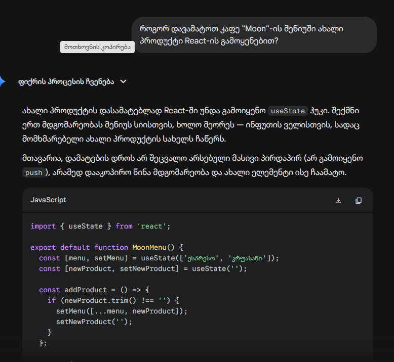
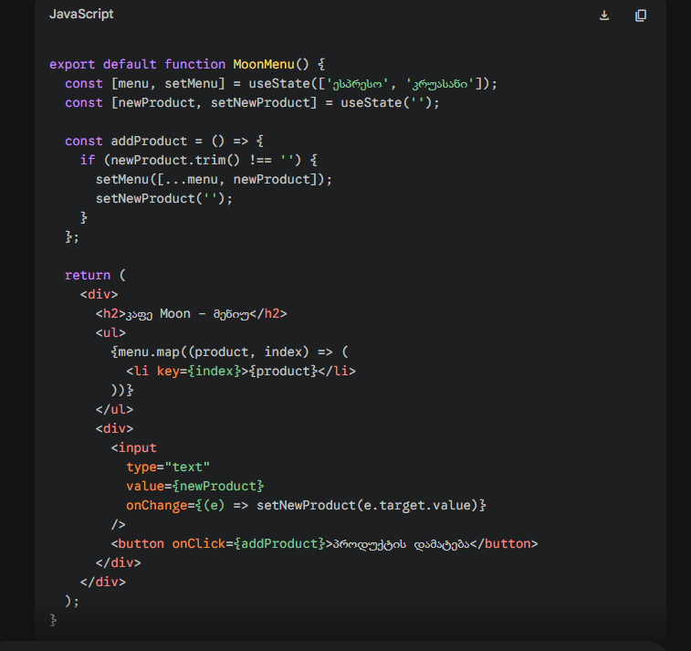
პასუხი შეცდომით: პირდაპირ შეგვიძლია შევცვალოთ მასივი push მეთოდით: menu.push('კაპუჩინო') და კომპონენტი ავტომატურად განახლდება ეკრანზე.
რა შეიცვალა შეცდომაში: React-ში state-ის პირდაპირ შეცვლა (მუტაცია) არ იწვევს კომპონენტის თავიდან დარენდერებას, შესაბამისად, ეკრანზე ცვლილება არ გამოჩნდება. მასივის სწორად გასაახლებლად უნდა გამოვიყენოთ მდგომარეობის განახლების ფუნქცია, მაგალითად setMenu([...menu, 'კაპუჩინო']).
2. 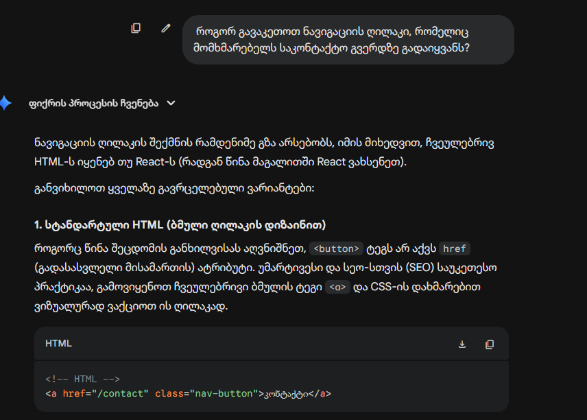
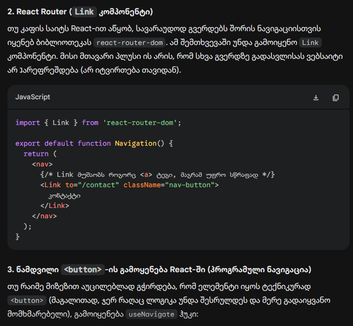
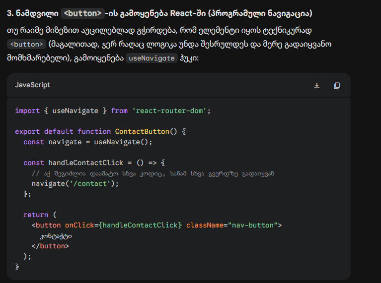
პასუხი შეცდომით: უნდა გამოვიყენოთ ღილაკის ტეგი href ატრიბუტით: <button href="/contact">კონტაქტი</button>
რა შეიცვალა შეცდომაში: HTML-ში <button> ტეგს არ აქვს href ატრიბუტი და სხვა გვერდზე გადასვლას ვერ უზრუნველყოფს. ამისთვის უნდა გამოვიყენოთ <a> ტეგი ან მარშრუტიზაციისთვის განკუთვნილი კომპონენტი (მაგალითად <Link to="/contact">)
3. 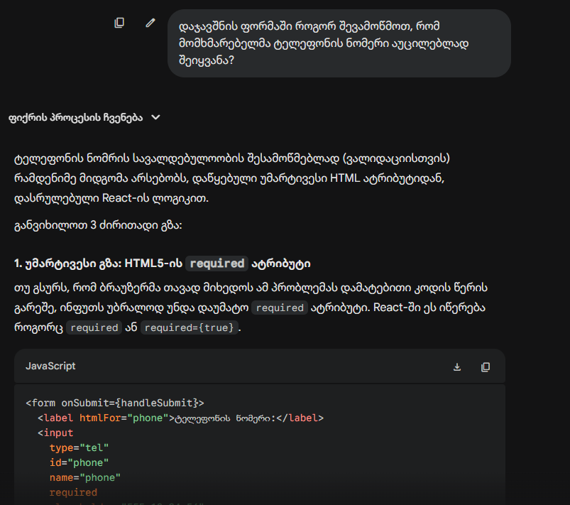
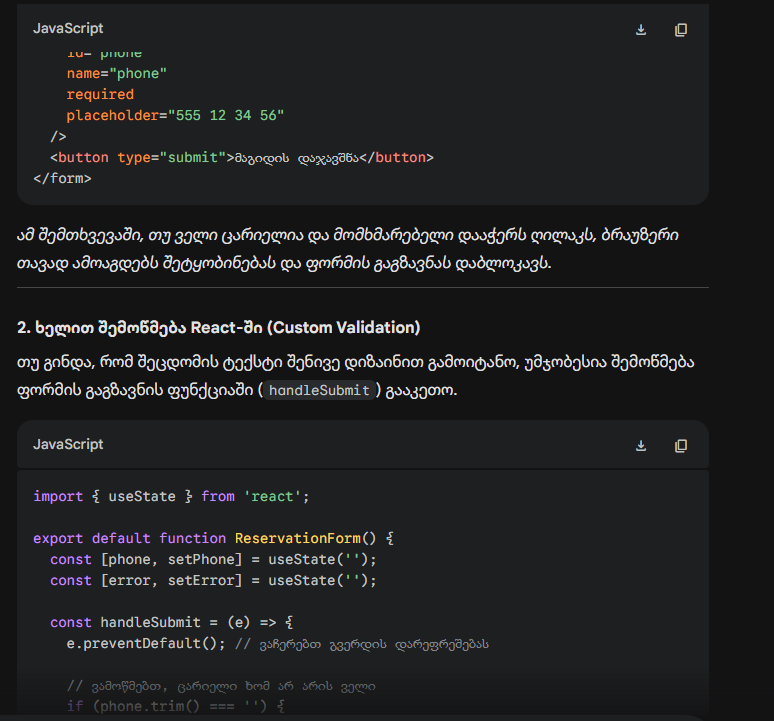
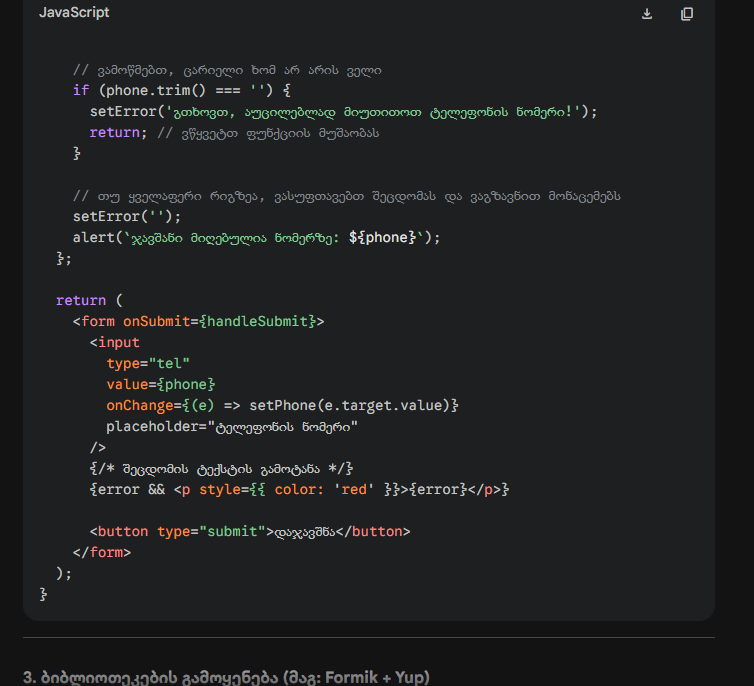
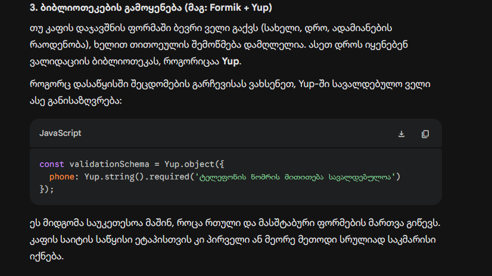
პასუხი შეცდომით: ინფუთის ველს უნდა მივუთითოთ ატრიბუტი required="false".
რა შეიცვალა შეცდომაში: მნიშვნელობა false ნიშნავს, რომ ველი არ არის სავალდებულო. აუცილებელი ველისთვის უნდა დაიწეროს required="true", ან ფორმის ვალიდაციის სქემაში (მაგალითად, Yup-ის გამოყენებისას) მიეთითოს სავალდებულოობის წესი Yup.string().required().
4. 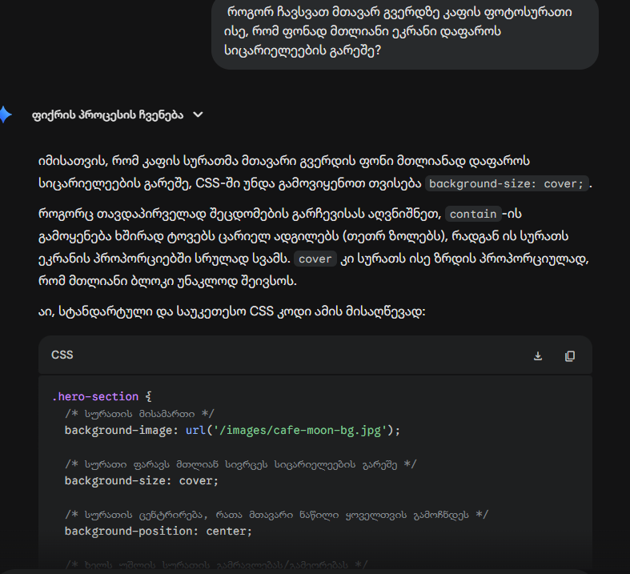
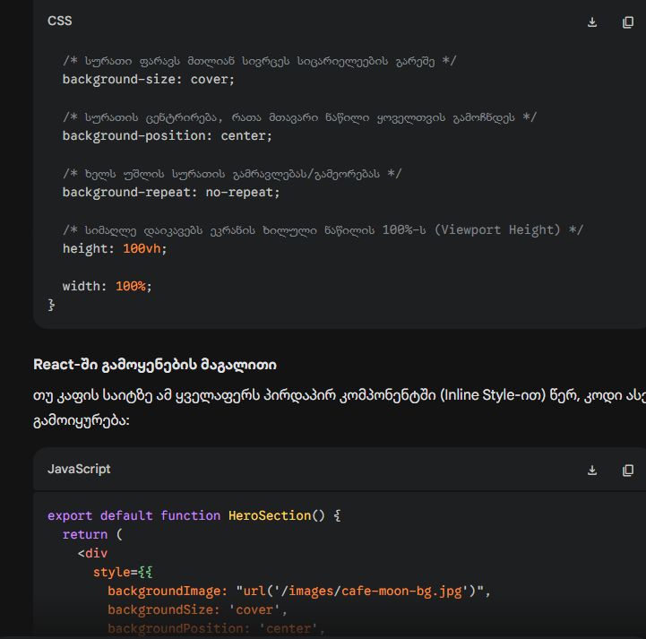
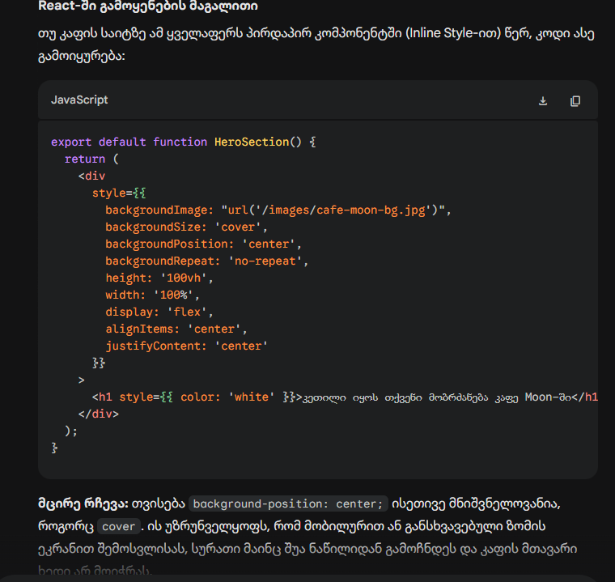
პასუხი შეცდომით: CSS-ში უნდა გამოვიყენოთ თვისება background-size: contain;
რა შეიცვალა შეცდომაში: მითითება contain სურათს ისე აპატარავებს, რომ მთლიანად ჩაეტიოს ეკრანზე. ამან შეიძლება გვერდებზე ან ზემოთ/ქვემოთ ცარიელი ადგილები დატოვოს. სრული დაფარვისთვის, პროპორციების დაცვით, სწორია background-size: cover;.


## ავტორი
**ანი მუშკუდიანი**

---
© 2026 Cafe Moon. ყველა უფლება დაცულია.
